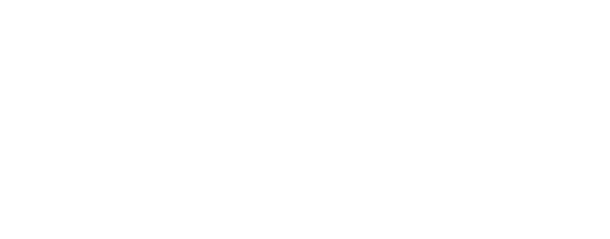

# Slic3r Post-Processing Uploader for 3D Print Log

A Slic3r/PrusaSlicer/OrcaSlicer/Bambu Studio Post-Processing script for uploading print details to https://www.3dprintlog.com.

[3D Print Log](https://www.3dprintlog.com) is a simple tool for tracking 3D prints. Easily record details of your 3D printers, filament usage, print status, print duration and more. Keeps track the filament remaining on your spools, and we have Cura/Octoprint/Moonraker, and now Slic3r integrations.

This Slic3r Uploader will parse your gcode file after export and open up https://www.3dprintlog.com with the print details automatically filled out.

Create a free account at https://www.3dprintlog.com today and enjoy all the features.

## Currently Supported Slicers:

This is a new project, currently a work in progress. Feel free to help out by submitting requests, bug reports, or helping to make Pull Requests.

- OrcaSlicer
- PrusaSlicer
- Bambu Studio
- FLSun Slicer
- Anycubic Slicer Next

#### Partial Support for: (templates with full settings up next)

- Super Slicer

## Usage:

Download the [latest release for your operating system](https://github.com/ChristopherHoffman/Slic3rPostProcessingUploader/releases), and save the file to a location on your computer.

In the Slicer's 'Post-Processing Scripts' section, add the path to this file. Full/Absolute paths are recommended:

### Examples:

Windows:

`C:\\uploader\\Slic3rPostProcessingUploader.exe [options]`

Mac/Linux:

`~/uploader/Slic3rPostProcessingUploader [options]`

#### Example of OrcaSlicer on Windows:


## Options:

`--help`, `-h`: Display this help message. No settings will be uploaded if help is displayed.

`--local-dev`: Use the local development environment

`--debug <path>`: Save debug information to the specified path

`--opt-out-telemetry`: Disable telemetry tracking. To help improve the plugin, we track slicer and plugin versions, as well as log errors that are thrown. No personal data is collected.

### Note Template Options:

`--default`: Use the default note template, which contains a curated list of general settings. Preferred by most users. The Default template is used if no other note template option is given.

`--full`: Use the full note template, which lists most of the settings available in the slicers

`--template <path>`: Use a custom note template. Absolute paths work better. See README for more details on syntax

## Example

In your Slicer's Post Processing text box, input:

`Slic3rPostProcessingUploader --default`

Once you slice your object and export the `.gcode` file, this plugin will run and open your default web browser to https://www.3dprintlog.com with all of the print details and settings filled out.

## Note Templates

If the provided `default` or `full` templates are not to your liking, you can create custom note templates by passing in the path to a text file containing the template. These can look for specific settings in the gcode file, and pull out the data.

Example:
`Slic3rPostProcessingUploader --template "C:\tmp\my-custom-template.txt"`

### Template Syntax

Any plain text will be displayed as-is in the note.

You can use `{{setting_name}}` to identify settings from the gcode file to use. This program will then look for `; setting_name = some value`, and replace `{{setting_name}}` with `some value`.

For example, OrcaSlicer's gcode files have a section at the bottom containing all the configuration like:

```
; CONFIG_BLOCK_START
; accel_to_decel_enable = 1
; accel_to_decel_factor = 50%
; activate_air_filtration = 0
; activate_chamber_temp_control = 0
; adaptive_bed_mesh_margin = 0
; adaptive_pressure_advance = 0
; adaptive_pressure_advance_bridges = 0
; adaptive_pressure_advance_model = "0,0,0\n0,0,0"
; adaptive_pressure_advance_overhangs = 0
...
```

If `my-custom-template.txt` contained the template:

```
This is my template.

I used these settings:
- Activate Air Filtration: {{activate_air_filtration}}
- Use Adaptive Pressure Advance: {{adaptive_pressure_advance}}
- Acceleration to Deceleration: {{accel_to_decel_factor}}
```

Then 3D Print Log will receive a note that is rendered like:

```
This is my template.

I used these settings:
- Activate Air Filtration: 0
- Use Adaptive Pressure Advance: 0
- Acceleration to Deceleration: 50%
```
